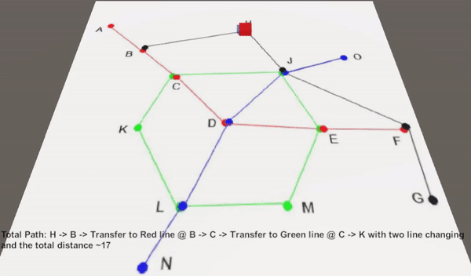

The figure shows a metro map of a virtual city.

Develop a data structure that will store this representation of metro routes.

Based on the developed structure, create an algorithm that searches for the shortest path from an arbitrary station to any other. The shortest path is the route with the least number of intermediate stations.

For each path found, it is necessary to indicate the number of transfers while moving along the route.

# DEMO

